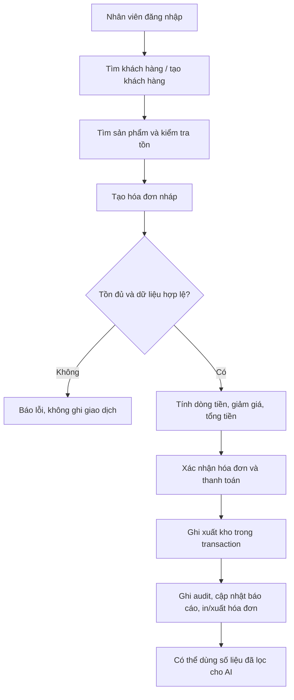
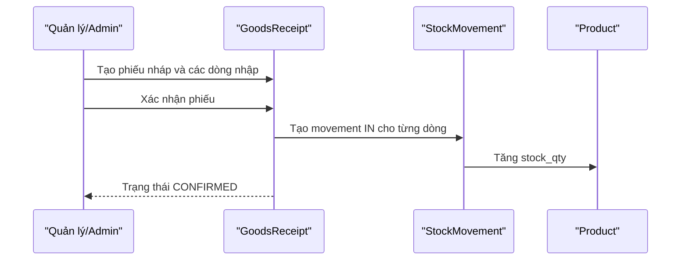
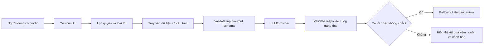

# Quy trình nghiệp vụ và bất biến dữ liệu

## 1. Luồng bán hàng mục tiêu

### Bất biến bắt buộc

- Hóa đơn phải có ít nhất một dòng hàng (`BR-004`).
- Số lượng từng dòng lớn hơn 0; tổng dòng = số lượng × đơn giá.
- Không được xác nhận nếu số lượng bán vượt tồn kho (`BR-003`).
- Giảm giá không âm và không vượt tổng trước giảm (`BR-017`).
- Hóa đơn đã xác nhận không sửa trực tiếp; hủy phải tạo điều chỉnh/hoàn kho
  theo chính sách được quyết định (`BR-013`, `BR-014`).
- Tạo hóa đơn và xuất kho phải nhất quán; nếu một bước lỗi, không để giao dịch
  ở trạng thái “đã bán” nhưng kho chưa giảm.

### Hiện trạng code cần lưu ý

Trong `sales_management/apps/sales/models.py`, `Invoice.confirm()` hiện kiểm tra
có dòng hàng và tính tổng rồi chuyển trạng thái. Trong file hiện tại chưa thấy
luồng tạo `StockMovement.OUT` khi xác nhận hóa đơn. `StockMovement.apply_to()` có
guard không cho tồn âm, nhưng guard đó chỉ có tác dụng khi movement được tạo và
áp dụng. Vì vậy FR-006/FR-009 chưa được coi là hoàn thành.

## 2. Luồng nhập hàng

Trong `sales_management/apps/inventory/models.py`, `GoodsReceipt.confirm()` đã
được đánh dấu `transaction.atomic`, yêu cầu ít nhất một dòng, tạo movement IN
và gọi `apply_to()`. Cần bổ sung kiểm thử cho gọi xác nhận hai lần, quantity
không hợp lệ, concurrent update và hủy phiếu.

## 3. Luồng tồn kho

Nguồn sự thật nên là lịch sử `StockMovement` cộng với số dư `Product.stock_qty`,
không phải một giá trị AI tự suy đoán.

| Sự kiện | Movement dự kiến | Tác động |
|---|---|---|
| Xác nhận nhập hàng | `IN` | Tăng tồn |
| Xác nhận bán hàng | `OUT` | Giảm tồn; từ chối nếu không đủ |
| Hủy bán hàng | `ADJUSTMENT` hoặc movement hoàn trả được định nghĩa rõ | Hoàn tồn |
| Kiểm kê/chỉnh lệch | `ADJUSTMENT` | Điều chỉnh có lý do và audit |

## 4. Luồng báo cáo

1. Xác định khoảng thời gian và quyền của người dùng.
2. Lấy dữ liệu đã xác nhận, không tính nháp/hủy trừ khi báo cáo yêu cầu.
3. Tính deterministic: doanh thu, số hóa đơn, top sản phẩm, tồn thấp.
4. Hiển thị số liệu nguồn.
5. Nếu gọi AI, chỉ gửi tập dữ liệu tối thiểu đã lọc và gắn nhãn “nhận xét tham
   khảo”; không để AI tự thay đổi số liệu.
6. Cho phép xuất file sau khi người dùng kiểm tra bộ lọc.

## 5. Luồng AI có kiểm soát

AI không được thực hiện thao tác ghi dữ liệu, đặt hàng hoặc tự quyết định thay
cho chủ cửa hàng (`BR-007`, `BR-008`).

## 6. Trạng thái nên chuẩn hóa

| Đối tượng | Trạng thái mục tiêu | Ghi chú |
|---|---|---|
| Invoice | `DRAFT` → `CONFIRMED` → `CANCELLED` | Không sửa trực tiếp sau confirm |
| GoodsReceipt | `DRAFT` → `CONFIRMED` → `CANCELLED` | Confirm phải idempotent và atomic |
| UserProfile | `ACTIVE`, `LOCKED`, `INACTIVE` | Lockout cần cơ chế thời hạn |
| AI request | `SUCCESS`, `FALLBACK`, `ERROR`, `HUMAN_REVIEW` | `AIEventLog` đã có enum ở một nhánh |

## 7. Các test nghiệp vụ tối thiểu

| ID | Tình huống | Kết quả bắt buộc |
|---|---|---|
| FLOW-T01 | Hóa đơn không có dòng | Từ chối, không đổi kho |
| FLOW-T02 | Số lượng bằng tồn | Xác nhận, tồn về 0 |
| FLOW-T03 | Số lượng vượt tồn | Từ chối, tồn giữ nguyên |
| FLOW-T04 | Nhập hàng hợp lệ | Tăng tồn đúng một lần |
| FLOW-T05 | Xác nhận phiếu nhập hai lần | Không tăng tồn lần hai |
| FLOW-T06 | Hủy hóa đơn | Hoàn kho theo chính sách, có audit |
| FLOW-T07 | Người không có quyền xem báo cáo | Từ chối ở server |
| FLOW-T08 | AI không có dữ liệu phù hợp | Nói rõ không đủ dữ liệu, không bịa |
