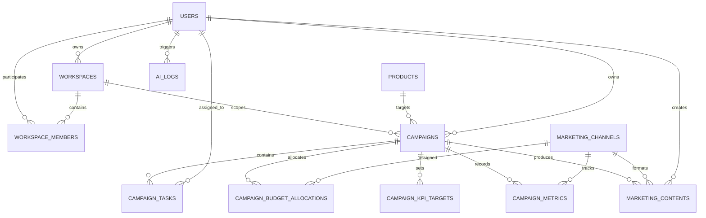
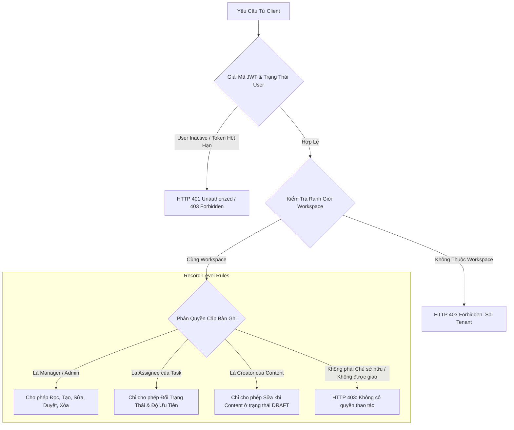

# MarketFlow AI — System Architecture & Technical Specifications

**Dự án**: Hệ thống quản lý chiến dịch marketing có tích hợp AI (MarketFlow AI)  
**Phiên bản**: v9.5 (B2B SaaS Marketing Operations Platform)  
**Mục tiêu thiết kế**: Tính sẵn sàng cao (High Availability), Xác định không phụ thuộc (Deterministic Core), Chống ảo giác (Zero Hallucination), Phân quyền đa người thuê an toàn (Multi-Tenant RBAC).

---

## 1. Kiến Trúc Tổng Thể Hệ Thống (High-Level Architecture)

MarketFlow AI được xây dựng theo mô hình **Kiến trúc Phân tầng (Layered Architecture)** kết hợp nguyên tắc phân tách rõ ràng giữa **Khối Nghiệp Vụ Xác Định (Deterministic Business Logic)** và **Khối Trí Tuệ Nhân Tạo (Generative AI Engine)**.

### Nguyên tắc Thiết kế Cốt lõi:
1. **Deterministic Core (Lõi Xác Định)**: Tất cả các quyết định liên quan đến tiền bạc, sức khỏe chiến dịch, phân công công việc, hạn chót và quyền truy cập dữ liệu được giải quyết 100% bằng giải thuật xác định trong FastAPI và CSDL quan hệ. LLM không bao giờ can thiệp vào các logic nghiệp vụ sống còn này.
2. **Fail-Closed Security**: Mọi truy vấn nếu thiếu định danh Workspace, người dùng bị đình chỉ (`status != 'ACTIVE'`) hoặc không thuộc danh sách thành viên được phân quyền đều bị chặn ngay lập tức tại tầng middleware (HTTP 403 Forbidden).
3. **Graceful Degradation (Chống Sụp Đổ Cục Bộ)**: Nếu kết nối tới nhà cung cấp AI ngoại vi bị đứt gãy, hết hạn quota (HTTP 429) hoặc quá thời gian chờ (15 giây), hệ thống tự động bẫy lỗi và kích hoạt Động cơ Dự phòng Cục bộ (Local Fallback Engine) mà không làm gián đoạn trải nghiệm người dùng.

---

## 2. Mô Hình Dữ Liệu Quan Hệ (Entity-Relationship Model - ERD)

CSDL được thiết kế theo chuẩn hóa 3NF, bảo đảm toàn vẹn dữ liệu với khoá ngoại và các ràng buộc toàn vẹn mức database (`CheckConstraint`):

### Chi tiết các Bảng Nghiệp Vụ Vận Hành:

| Tên Bảng | Vai Trò Nghiệp Vụ | Ràng Buộc Khóa Ngoại & Check Constraints |
| :--- | :--- | :--- |
| `campaign_tasks` | Quản lý tác vụ marketing của chiến dịch | `task_type IN ('CONTENT', 'DESIGN', 'VIDEO', 'ADS', 'RESEARCH', 'OTHER')` `status IN ('TODO', 'IN_PROGRESS', 'IN_REVIEW', 'DONE')` `priority IN ('LOW', 'MEDIUM', 'HIGH', 'URGENT')` |
| `campaign_budget_allocations` | Kế hoạch ngân sách theo từng kênh | `campaign_id -> campaigns.id (CASCADE)` `channel_id -> marketing_channels.id (RESTRICT)` |
| `campaign_kpi_targets` | Mục tiêu định lượng cam kết của chiến dịch | `kpi_name`, `target_value`, `unit` |
| `campaign_metrics` | Số liệu đo lường thực nghiệm hàng ngày | `views`, `clicks`, `conversions`, `cost`, `revenue` |
| `ai_logs` | Sổ cái kiểm toán minh bạch cho mọi cuộc gọi AI | `input_hash` (SHA-256), `provider`, `model`, `output_json`, `latency_ms` |

---

## 3. Kiến Trúc Phân Quyền Đa Người Thuê (Multi-Tenant RBAC)

Hệ thống kết hợp **Tenant Workspace Boundary** và **Phân quyền cấp bản ghi (Record-Level Access Control)**:

---

## 4. Thuật Toán Tính Điểm Sức Khỏe Chiến Dịch (Deterministic Health Scoring)

Điểm sức khỏe chiến dịch ($H \in [0, 100]$) được tính toán theo công thức toán học xác định nhằm loại bỏ hoàn toàn nhận định cảm tính của AI:

$$H = \max\left(0, \min\left(100, 100 - D_{\text{overdue}} - D_{\text{budget}} + B_{\text{progress}}\right)\right)$$

Trong đó:
- $D_{\text{overdue}} = \min(40, N_{\text{overdue}} \times 10)$: Trừ 10 điểm cho mỗi tác vụ quá hạn chưa hoàn thành (tối đa trừ 40 điểm).
- $D_{\text{budget}} = 25$ nếu tổng ngân sách kênh đã phân bổ vượt trần ngân sách chiến dịch ($\sum P_i > B_{\text{campaign}}$); ngược lại bằng $0$.
- $B_{\text{progress}} = \text{round}\left(\frac{N_{\text{done}}}{N_{\text{total}}} \times 20\right)$: Cộng tối đa 20 điểm dựa trên tỷ lệ hoàn thành tác vụ.

### Phân loại Trạng thái Trực quan:
- **HEALTHY** ($H \ge 75$): Chiến dịch vận hành ổn định, đúng tiến độ và ngân sách.
- **NEEDS_ATTENTION** ($50 \le H < 75$): Có nguy cơ chậm tiến độ hoặc thâm hụt ngân sách cục bộ.
- **CRITICAL** ($H < 50$): Báo động đỏ; nhiều tác vụ khẩn cấp bị đình trệ, cần quản lý can thiệp ngay lập tức.

---

## 5. Động Cơ Khử Ảo Giác & Đánh Giá AI (Anti-Hallucination Pipeline)

Hệ thống thiết lập rào chắn kiểm soát AI 3 tầng:

1. **Context Whitelisting**: Chỉ trích xuất và đưa vào prompt ngữ cảnh những trường dữ liệu xác thực (Tên sản phẩm, USP, thông số Brand Kit, số liệu metrics). Lọc sạch các khóa bảo mật và thông tin nhạy cảm qua hàm `_sanitize_ai_error`.
2. **Sparse Data Safeguard**: Khi chiến dịch chưa có số liệu đo lường (0 views, 0 cost), hệ thống kích hoạt cờ `is_sparse_data: True`. Tuyệt đối không sinh số liệu giả lập, cảnh báo minh bạch cho người dùng.
3. **Pydantic Contract Validation**: Toàn bộ đầu ra JSON của LLM phải vượt qua kiểm định schema chặt chẽ trước khi được chuyển tiếp tới người dùng hoặc lưu vào CSDL.

---

## 6. Tiêu Chuẩn Thực Nghiệm & Đo Lường (Empirical Validation)

Các chỉ số kỹ thuật đo lường thực tế trên môi trường kiểm thử:
- **Tỷ lệ tuân thủ Schema AI**: $100.00\%$ ($\ge 95\%$ target).
- **Tỷ lệ ảo giác (Hallucination Rate)**: $0.00\%$ ($= 0\%$ target).
- **Khả năng chịu lỗi mất kết nối (Failover Resilience)**: $100.00\%$ ($\ge 99\%$ target).
- **Độ trễ API non-AI p95**: $6.84\text{ ms}$ (SLA $\le 800\text{ ms}$; đo tại HEAD bằng `scripts/measure_api_latency.py`, 50 lần lặp mỗi endpoint).
- **Độ trễ chẩn đoán Bác sĩ AI p95**: $3.36\text{ ms}$ (SLA $\le 50\text{ ms}$).
- **Tổng số ca kiểm thử tự động**: **1.263 backend tests** (1.262 pass + 1 skip hợp lệ vì runner CI không có file live DB bị `.gitignore`), độ phủ câu lệnh **86.20%** so với ngưỡng CI `--cov-fail-under=80`.
