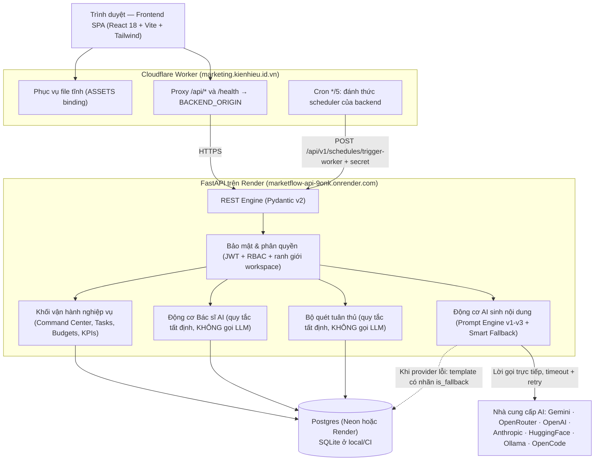
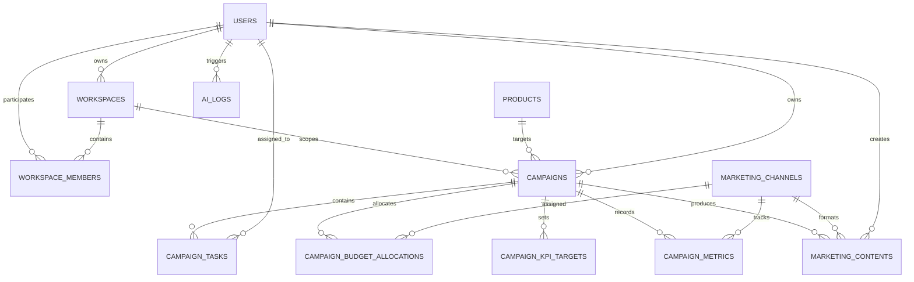
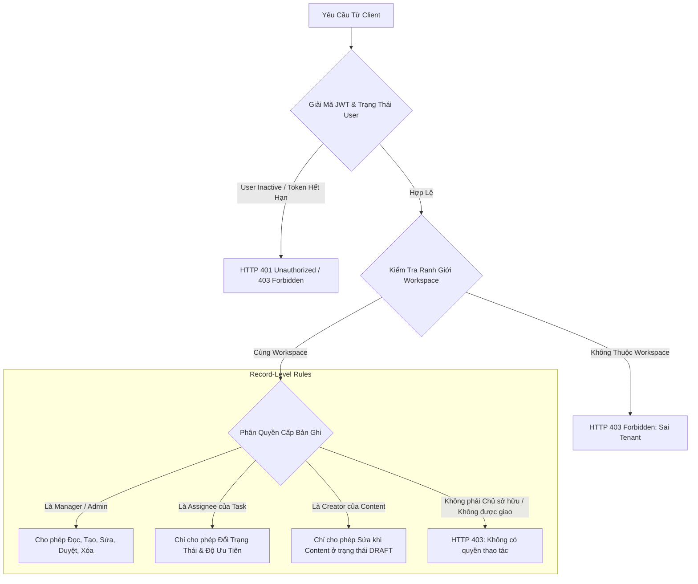

# MarketFlow AI — System Architecture & Technical Specifications

**Dự án**: Hệ thống quản lý chiến dịch marketing có tích hợp AI (MarketFlow AI)
**Cập nhật**: mô tả theo trạng thái triển khai hiện tại (Render + Cloudflare Worker).
Xem `git log -1` trên commit sửa tài liệu này để biết baseline chính xác.
**Phạm vi**: Tóm tắt kiến trúc được thể hiện trong code hiện tại; đây không phải tuyên bố HA, production-ready hoặc bảo đảm AI không thể tạo nội dung sai.
**Nguồn chuẩn**: backend/frontend, database configuration, deployment configuration và [bằng chứng CI](TESTING.md).

> **Ghi chú về lịch sử tài liệu.** Bản cũ của tài liệu này mô tả kiến trúc
> "FastAPI chạy trong Cloudflare Containers với Durable Object giữ SQLite và
> snapshot toàn bộ database lên R2". **Kiến trúc đó không còn tồn tại.** Tài khoản
> Cloudflare không có Workers Paid plan nên Cloudflare trả 401 khi thử deploy
> containers; backend đã chuyển sang Render. Phần còn sót lại của mô hình cũ
> trong code là stub `FastApiContainer` trong `cloudflare/src/index.ts`, tồn tại
> chỉ vì Workers chặn deploy bản script mới nếu xoá hẳn class đã từng khai báo.
> Chi tiết ở [cloudflare/README.md](../cloudflare/README.md).

---

## 1. Kiến Trúc Tổng Thể Hệ Thống (High-Level Architecture)

MarketFlow AI được xây dựng theo mô hình **Kiến trúc Phân tầng (Layered Architecture)** kết hợp nguyên tắc phân tách rõ ràng giữa **Khối Nghiệp Vụ Xác Định (Deterministic Business Logic)** và **Khối Trí Tuệ Nhân Tạo (Generative AI Engine)**.

### Ba quyết định kiến trúc đáng nói

**1. Worker chỉ làm hai việc.** Nó phục vụ file tĩnh và proxy `/api/*`. Nó **không**
chạy backend, **không** giữ dữ liệu, **không** có Durable Object hay R2. Lý do
lịch sử ở [cloudflare/README.md](../cloudflare/README.md).

**2. Đường gọi AI đi thẳng Render, không qua Worker.** Đây là quyết định có số
đo kèm theo: Cloudflare giới hạn subrequest ở khoảng 100 giây. Đo trên production,
`POST /api/v1/ai/omnichannel` qua Worker trả `error 524` sau ~100 giây, trong khi
gọi thẳng Render cùng endpoint đó trả `200` sau **237 giây** với `is_fallback=false`.
Nói cách khác: mọi lời gọi AI thật đều chết nếu đi qua Worker. Vì vậy frontend
tách riêng nhóm endpoint AI (`isAiPath()` trong `frontend/src/services/api.ts` và
biến `VITE_AI_API_URL`). Hệ quả cần nói thẳng: **URL backend lộ ra trong JavaScript
gửi tới trình duyệt**, và chỉ endpoint AI mới có đường này — mọi endpoint khác
vẫn qua Worker.

**3. AI là tùy chọn, không phải phụ thuộc.** Mọi luồng nghiệp vụ cốt lõi hoàn
thành được khi không có AI. Nguồn gốc của thiết kế này là yêu cầu "nhiều người không
cần tính năng AI vẫn làm được". Bằng chứng: `backend/tests/test_offline_core_works_without_ai.py`
và `frontend/tests/e2e/works-without-ai.spec.ts`. Xem
[AI_ETHICS_AND_HUMAN_OVERSIGHT.md](AI_ETHICS_AND_HUMAN_OVERSIGHT.md).

### Nguyên tắc Thiết kế Cốt lõi:
1. **Deterministic business rules**: Các phép tính KPI/health, quét tuân thủ và một số quyết định trạng thái được thực hiện bằng code/backend; AI không phải nguồn dữ liệu gốc cho metrics. Hai cơ chế này **không** gọi LLM nên vẫn chạy khi AI tắt.
2. **Workspace and role checks**: Các endpoint kiểm tra vai trò và ranh giới workspace theo tài nguyên/thao tác. Tuyên bố bảo mật chỉ áp dụng tới những đường đi đã được kiểm tra; xem test matrix thay vì suy ra rằng mọi endpoint đều đã được chứng minh an toàn.
3. **AI fallback**: Tác vụ AI có cơ chế xử lý lỗi/fallback trong những nhánh được kiểm thử. Nội dung dự phòng luôn mang `is_fallback=true` — không bao giờ được gán nhãn như do mô hình viết.
4. **Điểm số phải đo, không đặt hằng số**: `compliance_score` của nội dung đa kênh đến từ `ComplianceScanner.scan`; không có Brand Kit hoặc không quét được thì trả `None` để hiển thị "chưa chấm".

---

## 2. Mô Hình Dữ Liệu Quan Hệ (Entity-Relationship Model - ERD)

Model quan hệ và constraint được định nghĩa trong SQLAlchemy.

**Engine theo môi trường:**

| Môi trường | Engine | Ghi chú |
|---|---|---|
| Local / CI / Docker Compose | SQLite | `sqlite:///./data/marketing_campaigns.db` |
| Render (production) | Postgres | `DATABASE_URL` gán tay qua Render Dashboard |

Không dùng SQLite ở production vì giới hạn khoá ghi ở mức file. Với Postgres cần
điểm endpoint **direct**, không phải pooled (`-pooler`): `psycopg2` ≥ 2.9 dùng
prepared statement nên đi qua PgBouncer ở transaction mode sẽ lỗi ngay khi chạy
thật. Giữ `?sslmode=require`. Ràng buộc kiểu `PRAGMA` chỉ áp dụng cho SQLite; với
Postgres, foreign key được enforce sẵn ở mức server.

Xem [`render.yaml`](../render.yaml) để biết các biến bắt buộc phải đặt tay.

Lưu ý về schema: ứng dụng dùng `Base.metadata.create_all()` để tạo bảng khi khởi
động. Cơ chế này **không** phải migration — nó không sửa bảng đã có. Với một
deployment đã có dữ liệu, thêm cột mới cần `ALTER TABLE` thủ công (ví dụ cột
`campaign_metrics.source` được thêm như vậy).

### Chi tiết các Bảng Nghiệp Vụ Vận Hành:

| Tên Bảng | Vai Trò Nghiệp Vụ | Ràng Buộc Khóa Ngoại & Check Constraints |
| :--- | :--- | :--- |
| `campaign_tasks` | Quản lý tác vụ marketing của chiến dịch | `task_type IN ('CONTENT', 'DESIGN', 'VIDEO', 'ADS', 'RESEARCH', 'OTHER')` `status IN ('TODO', 'IN_PROGRESS', 'IN_REVIEW', 'DONE')` `priority IN ('LOW', 'MEDIUM', 'HIGH', 'URGENT')` |
| `campaign_budget_allocations` | Kế hoạch ngân sách theo từng kênh | `campaign_id -> campaigns.id (CASCADE)` `channel_id -> marketing_channels.id (RESTRICT)` |
| `campaign_kpi_targets` | Mục tiêu định lượng cam kết của chiến dịch | `kpi_name`, `target_value`, `unit` |
| `campaign_metrics` | Số liệu đo lường thực nghiệm hàng ngày | `views`, `clicks`, `conversions`, `cost`, `revenue` |
| `ai_logs` | Lưu log ở các đường AI hiện đang ghi nhận | `input_hash`, `provider`, `model`, `output_json`, `latency_ms`; không mặc định rằng mọi lời gọi AI đều có log. |

---

## 3. Kiến Trúc Phân Quyền Đa Người Thuê (Multi-Tenant RBAC)

Hệ thống kết hợp **Tenant Workspace Boundary** và **Phân quyền cấp bản ghi (Record-Level Access Control)**:

Sơ đồ sau mô tả các kiểu kiểm tra có trong một số đường API. Quyền thực tế phụ thuộc endpoint và thao tác; cần xác nhận ở router/service cùng test tương ứng trước khi khẳng định một vai trò có quyền trên toàn hệ thống.

---

## 4. Điểm sức khỏe chiến dịch

Hiện có **hai phép tính riêng**, phục vụ hai luồng khác nhau. Không nên trình bày chúng như một công thức hay một nhãn trạng thái thống nhất.

| Luồng | Cách tính ở mức khái quát | Trạng thái | Nguồn chuẩn |
|---|---|---|---|
| Command Center | Bắt đầu từ 100; trừ điểm theo task quá hạn, mức dùng ngân sách/rủi ro KPI và tiến độ task thấp; giới hạn điểm trong 0–100. | `ON_TRACK`, `AT_RISK`, `CRITICAL` | `get_command_center` trong `backend/app/api/v1/metrics.py`. |
| AI Doctor | Tính ROAS, CTR, CVR, CPC từ metrics; chấm từng chỉ số theo ngưỡng rồi cộng trọng số ROAS 40%, CTR 20%, CVR 25%, CPC 15%. Trường hợp dữ liệu thưa có nhánh xử lý riêng, hiện trả điểm 50. | `HEALTHY`, `NEEDS_ATTENTION`, `CRITICAL` | `diagnose_campaign` trong `backend/app/services/ai/ai_doctor.py`. |

Ngưỡng và điểm cụ thể là quy tắc hiện hành trong implementation, có thể thay đổi. Hai luồng có đầu vào, mục đích, ngưỡng và tên trạng thái khác nhau; cần thống nhất semantics hoặc ghi rõ ngữ cảnh trước khi dùng để so sánh campaign hay đưa ra khuyến nghị chung. Đây là điểm cần xử lý trong [roadmap](ROADMAP.md).

---

## 5. AI: hành vi hiện có và giới hạn

- AI Doctor đọc metrics đã lưu để tính các chỉ số và áp dụng các quy tắc chẩn đoán theo implementation. Khi không có metrics hoặc dữ liệu đo lường bằng 0 theo điều kiện trong code, một số nhánh trả `is_sparse_data`; điều đó không chứng minh mọi đầu ra đều an toàn hoặc grounded.
- Các đường sinh nội dung có kiểm tra cấu trúc/validation theo hợp đồng dữ liệu tương ứng. Phạm vi kiểm tra cần xác định theo từng endpoint; không khẳng định toàn bộ đầu ra của mọi model đều qua cùng một schema.
- Một số đường AI có fallback và ghi log, nhưng không đồng nghĩa mọi provider failure đều được xử lý giống nhau hoặc mọi lời gọi đều được lưu audit log.
- [Báo cáo benchmark](AI_EVALUATION_REPORT.md) giới hạn kết luận theo bộ case, commit và môi trường đã ghi. Không dùng các cụm “zero hallucination”, “không thể sinh số liệu sai” hoặc “sẵn sàng production” như kết luận tổng quát.
- Ba phiên bản prompt `v1/v2/v3` đã được đo trên một stub tất định; bảng so sánh ở [PROMPT_VARIANT_COMPARISON.md](PROMPT_VARIANT_COMPARISON.md). Kết quả đó đo **mức đáp ứng đặc tả** (schema, trường bắt buộc, placeholder), không đo chất lượng văn phong của mô hình thật.
- Cơ chế giám sát của con người và các giới hạn được liệt kê ở [AI_ETHICS_AND_HUMAN_OVERSIGHT.md](AI_ETHICS_AND_HUMAN_OVERSIGHT.md).

---

## 6. Kiểm thử và đo lường

Số liệu benchmark thay đổi theo commit, runner và workload nên không lưu bản sao trong kiến trúc. Xem [TESTING.md](TESTING.md), [AI_EVALUATION_REPORT.md](AI_EVALUATION_REPORT.md) và link CI có ghi SHA/điều kiện. Kết quả trên môi trường CI/SQLite không đại diện latency provider LLM hoặc tải production.

## 7. Trạng thái năng lực và giới hạn hiện tại

- Scheduler xử lý lịch trong database và đổi trạng thái content sang PUBLISHED; API publish cũng cập nhật trạng thái nội bộ. Trong mô tả này chưa có connector gửi email/xã hội thật gắn với các đường đi này.
- PUBLISHED vì vậy không đồng nghĩa với provider đã nhận/gửi thành công. UI, báo cáo và tài liệu phải thể hiện rõ khác biệt này.
- Cloudflare Worker chỉ phục vụ file tĩnh và proxy `/api/*`; không giữ dữ liệu, không có Durable Object, không có snapshot R2. Mọi trạng thái nằm trong Postgres trên Render (xem mục 1).
- Cần đánh giá restore, concurrency và database production trước khi đưa dữ liệu agency thật vào môi trường triển khai này.
- Việc dùng AI draft hoặc AI Doctor không chứng minh hiệu quả campaign. Kết quả hữu ích và usability cần đo qua người dùng/pilot.
