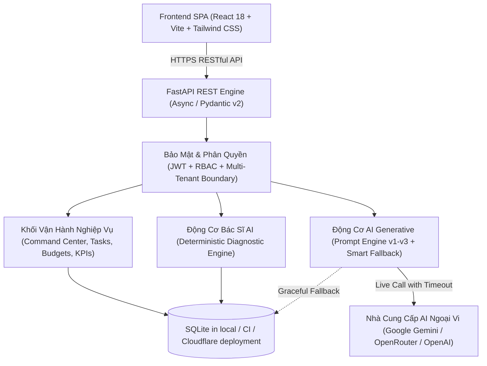
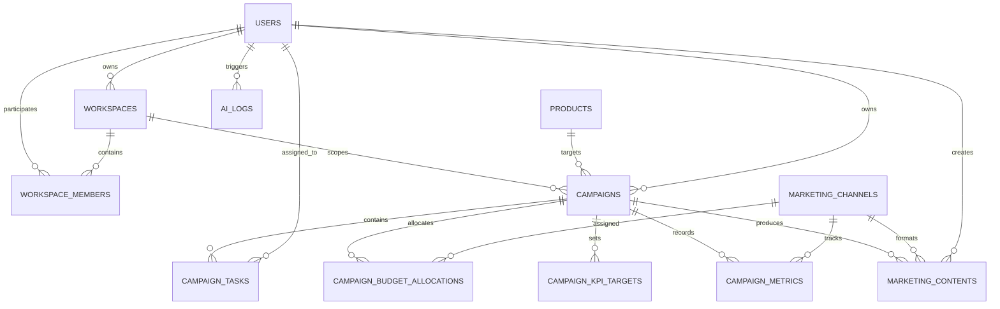
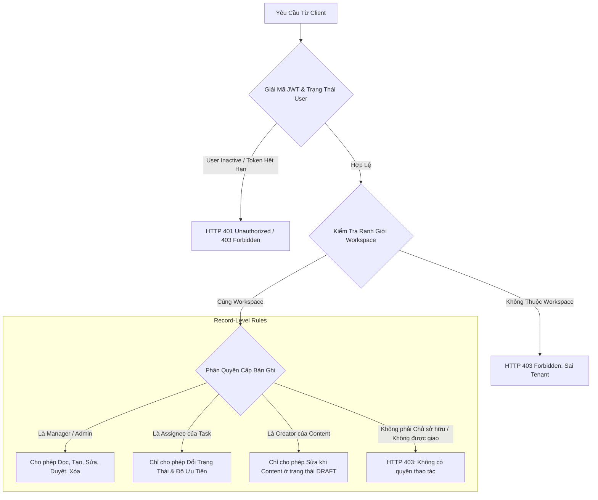

# MarketFlow AI — System Architecture & Technical Specifications

**Dự án**: Hệ thống quản lý chiến dịch marketing có tích hợp AI (MarketFlow AI)
**Baseline mô tả**: main tại b99ac876a06993edfb5a88d866c22080434e7372 (2026-09-29)
**Phạm vi**: Tóm tắt kiến trúc được thể hiện trong code hiện tại; đây không phải tuyên bố HA, production-ready hoặc bảo đảm AI không thể tạo nội dung sai.
**Nguồn chuẩn**: backend/frontend, database configuration, deployment configuration và [bằng chứng CI](TESTING.md).

---

## 1. Kiến Trúc Tổng Thể Hệ Thống (High-Level Architecture)

MarketFlow AI được xây dựng theo mô hình **Kiến trúc Phân tầng (Layered Architecture)** kết hợp nguyên tắc phân tách rõ ràng giữa **Khối Nghiệp Vụ Xác Định (Deterministic Business Logic)** và **Khối Trí Tuệ Nhân Tạo (Generative AI Engine)**.

### Nguyên tắc Thiết kế Cốt lõi:
1. **Deterministic business rules**: Các phép tính KPI/health và một số quyết định trạng thái được thực hiện bằng code/backend; AI không phải nguồn dữ liệu gốc cho metrics. Chi tiết từng phép tính cần đối chiếu implementation và test liên quan.
2. **Workspace and role checks**: Các endpoint kiểm tra vai trò và ranh giới workspace theo tài nguyên/thao tác. Tuyên bố bảo mật chỉ áp dụng tới những đường đi đã được kiểm tra; xem test matrix thay vì suy ra rằng mọi endpoint đều đã được chứng minh an toàn.
3. **AI fallback**: Tác vụ AI có cơ chế xử lý lỗi/fallback trong những nhánh được kiểm thử. Điều đó không bảo đảm mọi trải nghiệm không gián đoạn hoặc mọi nội dung sinh ra chính xác.

---

## 2. Mô Hình Dữ Liệu Quan Hệ (Entity-Relationship Model - ERD)

Model quan hệ và constraint được định nghĩa trong SQLAlchemy. Local/CI và Cloudflare deployment hiện dùng SQLite. Việc cấu hình URL cho một database engine khác không tự chứng minh migration, concurrency hay hành vi production đã được xác nhận.

### Chi tiết các Bảng Nghiệp Vụ Vận Hành:

| Tên Bảng | Vai Trò Nghiệp Vụ | Ràng Buộc Khóa Ngoại & Check Constraints |
| :--- | :--- | :--- |
| `campaign_tasks` | Quản lý tác vụ marketing của chiến dịch | `task_type IN ('CONTENT', 'DESIGN', 'VIDEO', 'ADS', 'RESEARCH', 'OTHER')` `status IN ('TODO', 'IN_PROGRESS', 'IN_REVIEW', 'DONE')` `priority IN ('LOW', 'MEDIUM', 'HIGH', 'URGENT')` |
| `campaign_budget_allocations` | Kế hoạch ngân sách theo từng kênh | `campaign_id -> campaigns.id (CASCADE)` `channel_id -> marketing_channels.id (RESTRICT)` |
| `campaign_kpi_targets` | Mục tiêu định lượng cam kết của chiến dịch | `kpi_name`, `target_value`, `unit` |
| `campaign_metrics` | Số liệu đo lường thực nghiệm hàng ngày | `views`, `clicks`, `conversions`, `cost`, `revenue` |
| `ai_logs` | Lưu log ở các đường AI hiện đang ghi nhận | `input_hash`, `provider`, `model`, `output_json`, `latency_ms`; không mặc định rằng mọi lời gọi AI đều có log. |

---

## 3. Kiến Trúc Phân Quyền Đa Người Thuê (Multi-Tenant RBAC)

Hệ thống kết hợp **Tenant Workspace Boundary** và **Phân quyền cấp bản ghi (Record-Level Access Control)**:

Sơ đồ sau mô tả các kiểu kiểm tra có trong một số đường API. Quyền thực tế phụ thuộc endpoint và thao tác; cần xác nhận ở router/service cùng test tương ứng trước khi khẳng định một vai trò có quyền trên toàn hệ thống.

---

## 4. Điểm sức khỏe chiến dịch

Ở baseline này có **hai phép tính riêng**, phục vụ hai luồng khác nhau. Không nên trình bày chúng như một công thức hay một nhãn trạng thái thống nhất.

| Luồng | Cách tính ở mức khái quát | Trạng thái | Nguồn chuẩn |
|---|---|---|---|
| Command Center | Bắt đầu từ 100; trừ điểm theo task quá hạn, mức dùng ngân sách/rủi ro KPI và tiến độ task thấp; giới hạn điểm trong 0–100. | `ON_TRACK`, `AT_RISK`, `CRITICAL` | `get_command_center` trong `backend/app/api/v1/metrics.py`. |
| AI Doctor | Tính ROAS, CTR, CVR, CPC từ metrics; chấm từng chỉ số theo ngưỡng rồi cộng trọng số ROAS 40%, CTR 20%, CVR 25%, CPC 15%. Trường hợp dữ liệu thưa có nhánh xử lý riêng, hiện trả điểm 50. | `HEALTHY`, `NEEDS_ATTENTION`, `CRITICAL` | `diagnose_campaign` trong `backend/app/services/ai/ai_doctor.py`. |

Ngưỡng và điểm cụ thể là quy tắc hiện hành trong implementation, có thể thay đổi. Hai luồng có đầu vào, mục đích, ngưỡng và tên trạng thái khác nhau; cần thống nhất semantics hoặc ghi rõ ngữ cảnh trước khi dùng để so sánh campaign hay đưa ra khuyến nghị chung. Đây là điểm cần xử lý trong [roadmap](ROADMAP.md).

---

## 5. AI: hành vi hiện có và giới hạn

- AI Doctor đọc metrics đã lưu để tính các chỉ số và áp dụng các quy tắc chẩn đoán theo implementation. Khi không có metrics hoặc dữ liệu đo lường bằng 0 theo điều kiện trong code, một số nhánh trả `is_sparse_data`; điều đó không chứng minh mọi đầu ra đều an toàn hoặc grounded.
- Các đường sinh nội dung có kiểm tra cấu trúc/validation theo hợp đồng dữ liệu tương ứng. Phạm vi kiểm tra cần xác định theo từng endpoint; không khẳng định toàn bộ đầu ra của mọi model đều qua cùng một schema.
- Một số đường AI có fallback và ghi log, nhưng không đồng nghĩa mọi provider failure đều được xử lý giống nhau hoặc mọi lời gọi đều được lưu audit log.
- [Báo cáo benchmark](AI_EVALUATION_REPORT.md) giới hạn kết luận theo bộ case, commit và môi trường đã ghi. Không dùng các cụm “zero hallucination”, “không thể sinh số liệu sai” hoặc “sẵn sàng production” như kết luận tổng quát.

---

## 6. Kiểm thử và đo lường

Số liệu benchmark thay đổi theo commit, runner và workload nên không lưu bản sao trong kiến trúc. Xem [TESTING.md](TESTING.md), [AI_EVALUATION_REPORT.md](AI_EVALUATION_REPORT.md) và link CI có ghi SHA/điều kiện. Kết quả trên môi trường CI/SQLite không đại diện latency provider LLM hoặc tải production.

## 7. Trạng thái năng lực và giới hạn hiện tại

- Scheduler xử lý lịch trong database và đổi trạng thái content sang PUBLISHED; API publish cũng cập nhật trạng thái nội bộ. Trong baseline mô tả ở đây chưa có connector gửi email/xã hội thật gắn với các đường đi này.
- PUBLISHED vì vậy không đồng nghĩa với provider đã nhận/gửi thành công. UI, báo cáo và tài liệu phải thể hiện rõ khác biệt này.
- Cloudflare worker dùng một Durable Object/SQLite container, tuần tự hóa các thao tác ghi và tải snapshot database lên R2 sau mỗi write. Mã worker ghi nhận độ trễ/chi phí O(kích thước DB) và queue toàn cục là nợ kỹ thuật; xem [cloudflare/README.md](../cloudflare/README.md).
- Cần đánh giá restore, concurrency và database production trước khi đưa dữ liệu agency thật vào môi trường triển khai này.
- Việc dùng AI draft hoặc AI Doctor không chứng minh hiệu quả campaign. Kết quả hữu ích và usability cần đo qua người dùng/pilot.
