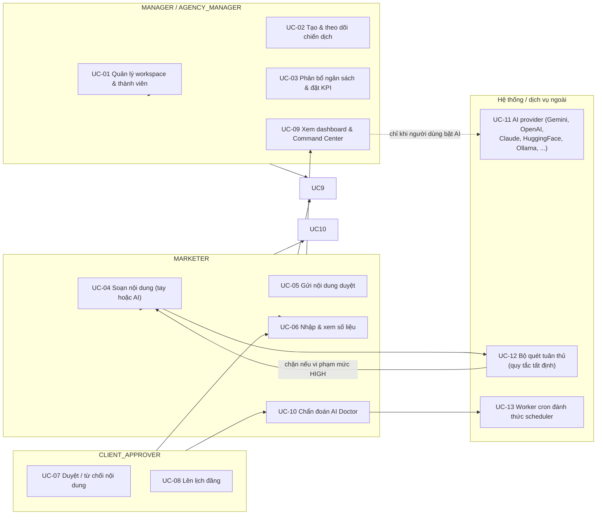

# Phân tích yêu cầu & thiết kế hệ thống MarketFlow AI

**Phục vụ:** Bài kiểm tra thường xuyên 1 — mục 1, 2, 3, 4, 7, 8, 9, 10.
Mục 5 (ERD) và mục 6 (kiến trúc) đã có ở [ARCHITECTURE.md](ARCHITECTURE.md).
Bảng đối chiếu 40 tiêu chí của cả 4 phần rubric nằm ở
[UNIVERSITY_DEFENSE_RUBRIC_ALIGNMENT.md](UNIVERSITY_DEFENSE_RUBRIC_ALIGNMENT.md).

**Nguyên tắc.** Mỗi yêu cầu ở đây đều dẫn tới nơi nó được hiện thực. Yêu cầu nào
chỉ mới là định hướng thì ghi rõ là đề xuất, không trộn vào phần đã làm. Nếu giảng
viên hỏi "cái này có thật không", câu trả lời phải là một đường dẫn file hoặc một
tên test.

---

## 1. Bối cảnh nghiệp vụ, người dùng, dữ liệu, vấn đề cần giải quyết

### 1.1 Bối cảnh

Quản lý chiến dịch marketing của một agency nhỏ–vừa. Một chiến dịch gắn với
một sản phẩm, đi qua nhiều kênh (Facebook, TikTok, email, blog, Google Ads), có
ngân sách phân bổ theo kênh và có chỉ tiêu KPI định lượng.

### 1.2 Các vấn đề thực tế và cách hệ thống giải quyết

| Vấn đề | Biểu hiện cụ thể | Cách hệ thống xử lý |
|---|---|---|
| Nội dung viết tay chậm, mỗi kênh một cách văn | Marketer mất hàng giờ cho 5 bản | Sinh nội dung theo từng kênh, có `channel_id` và ràng buộc kênh (ví dụ tiêu đề email ≤ 60 ký tự trong seed) |
| Sản phẩm phải qua nhiều bước trước khi đăng | Bài đăng nhầm, bài vi phạm quy định | Bắt buộc đi qua state machine DRAFT → AI_DRAFT → PENDING_REVIEW → APPROVED → PUBLISHED, chuyển trạng thái chỉ bằng endpoint riêng |
| Không biết chiến dịch đang ở đâu | Manager hỏi lại từng người | Command Center dựng trên task, ngân sách, KPI đã lưu |
| Số liệu trong báo cáo không rõ là thật hay mẫu | Báo cáo tăng trưởng nhưng không kiểm chứng được | Cột `campaign_metrics.source` phân biệt dữ liệu thật / seed / không rõ nguồn gốc; API trả `data_provenance`; UI bắt buộc cảnh báo |
| Không ai kiểm soát nội dung AI | Nội dung đăng sai giọng thương hiệu | Bộ quét `ComplianceScanner` chạy trước khi gửi duyệt; vi phạm mức HIGH chặn luôn |
| Người dùng tin AI "luôn đúng" | Điểm 100/100 hiện ra dù chưa quét gì | `compliance_score` nay là kết quả quét thật hoặc `None`; xem [AI_ETHICS_AND_HUMAN_OVERSIGHT.md](AI_ETHICS_AND_HUMAN_OVERSIGHT.md) mục 3 |

### 1.3 Người dùng (tác nhân)

Năm vai trò trong hệ thống, ràng buộc bằng `CheckConstraint` tại
`backend/app/models/entities.py`:

| Vai trò | Tài khoản mẫu (seed) | Nhiệm vụ chính |
|---|---|---|
| `MANAGER` | `manager@gmail.com` | Quản lý workspace, chiến dịch, thành viên, phê duyệt |
| `MARKETER` | `marketer@gmail.com` | Nhận brief, soạn nội dung, gửi duyệt, xem dashboard |
| `CLIENT_APPROVER` | `approver@gmail.com` | Duyệt hoặc từ chối nội dung |
| `AGENCY_MANAGER` | — (tạo qua luồng quản trị) | Quản trị cấp agency |
| `ADMIN` | — (tạo qua `bootstrap_admin.py`) | Quản trị hệ thống |

Mật khẩu seed đọc từ biến môi trường `MARKETFLOW_*_PASSWORD`; **không** dùng ở
production. Tài khoản đặc quyền không tự đăng ký được qua API.

### 1.4 Dữ liệu

| Nhóm | Bảng |
|---|---|
| Danh tính & tenant | `users`, `workspaces`, `workspace_members`, `campaign_members` |
| Nghiệp vụ lõi | `campaigns`, `campaign_tasks`, `campaign_budget_allocations`, `campaign_kpi_targets`, `campaign_metrics` |
| Nội dung & kênh | `marketing_channels`, `marketing_contents`, `content_reviews`, `products`, `product_categories` |
| Thương hiệu | `brand_kits` (một workspace một bộ) |
| Vận hành | `marketing_schedules`, `notifications` |
| AI | `ai_logs` (provider, model, prompt_version, input_hash, source_ids, status, latency) |
| Cấu hình | `custom_api_keys` (khoá BYOK đã mã hoá) |

`content_reviews` lưu lịch sử quyết định của người duyệt (`APPROVED`,
`REJECTED`, `REQUEST_CHANGES` kèm lý do) — đây là nhật ký kiểm toán của luồng duyệt.

---

## 2. Yêu cầu chức năng (đầu vào → xử lý → đầu ra)

| # | Chức năng cốt lõi | Đầu vào | Xử lý | Đầu ra | Nơi hiện thực |
|---|---|---|---|---|---|
| FR-1 | Đăng nhập / phiên | email + mật khẩu | Xác thực hash (bcrypt), kiểm tra `status='ACTIVE'` | access token + hồ sơ người dùng | `api/v1/auth.py` |
| FR-2 | Quản lý chiến dịch | tên, mục tiêu, budget, KPI, sản phẩm | Kiểm tra workspace, validate ngân sách, lưu | chiến dịch đầy đủ | `api/v1/campaigns.py` |
| FR-3 | Giao và theo dõi tác vụ | task, assignee, deadline | Kiểm tra quyền assignee | task + trạng thái | `api/v1/tasks.py` |
| FR-4 | Soạn nội dung **không dùng AI** | tiêu đề, thân, CTA | Lưu `DRAFT`, không gọi AI | content ở trạng thái nháp | `POST /contents`, `ManualContentComposer.tsx` |
| FR-5 | Soạn nội dung **có dùng AI** | brief chiến dịch + sản phẩm + kênh + giọng văn | Dựng prompt từ `prompts.json`, gọi provider, validate schema | nội dung + `is_fallback` + cảnh báo | `api/v1/ai.py` |
| FR-6 | Quét tuân thủ | nội dung + Brand Kit | So khớp từ khoá cấm (có bỏ dấu) + 38 quy tắc `AD_POLICY` | điểm, danh sách vi phạm, `can_submit` | `services/compliance/` |
| FR-7 | Duyệt / từ chối nội dung | content ở `PENDING_REVIEW` | Chuyển trạng thái, ghi vào `content_reviews`, ghi thông báo | content ở trạng thái mới + lý do | `contents.py` (`submit`/`approve`/`reject`) |
| FR-8 | Lên lịch đăng | content đã `APPROVED` + thời điểm | Tạo lịch, worker cron xử lý | lịch `PENDING` → `EXECUTED`, content → `PUBLISHED` | `api/v1/schedules.py` |
| FR-9 | Nhập và xem số liệu | metrics theo ngày/kênh | Lưu kèm `source`, tổng hợp KPI, ROAS | KPI summary + cảnh báo dữ liệu mẫu | `api/v1/metrics.py` |
| FR-10 | Command Center & AI Doctor | metrics + task + ngân sách | Quy tắc tất định, không gọi LLM | điểm sức khoẻ + khuyến nghị | `metrics.py`, `services/ai/ai_doctor.py` |
| FR-11 | Brand Kit | thương hiệu, USP, giọng văn, từ khoá cấm | Lưu, dùng làm đầu vào AI và bộ quét | brand kit | `api/v1/brand_kit.py` |
| FR-12 | Tìm / lọc / sắp xếp | query params | Lọc ở tầng query, có `order_by` xác định | danh sách đã lọc | `campaigns.py` (`search`, `status`, `channel_id`, `start_date`, `end_date`), `contents.py`, `tasks.py` (`status`, `priority`, `assignee_id`) |
| FR-13 | Cấu hình provider & khoá | provider, base URL, API key | Lưu khoá mã hoá Fernet, kiểm tra kết nối | masked key + trạng thái provider | `api/v1/settings.py` |

**Phân trang — nói thẳng phần chưa đủ.** `GET /notifications` có `limit`
(1–100); `GET /ai/logs` giới hạn 50 bản ghi. Nhưng `GET /campaigns`,
`GET /contents` và `GET /tasks` trả về **toàn bộ** danh sách, không có `limit`/
`offset`. Với vài trăm chiến dịch thì chấp nhận được; với dữ liệu thật của agency
nhiều năm thì đây là điểm thiếu cần bổ sung. Xem [ROADMAP.md](ROADMAP.md).

**Ngoài phạm vi, đã nói rõ là chưa làm:** gửi email thật, đăng lên mạng xã hội thật.
`PUBLISHED` hiện chỉ là trạng thái nội bộ.

---

## 3. Yêu cầu phi chức năng

| Nhóm | Yêu cầu | Cơ chế đã có | Bằng chứng |
|---|---|---|---|
| Bảo mật | Mật khẩu không lưu dạng rõ | bcrypt qua `hash_password` | test bảo mật backend |
| Bảo mật | Khoá API của khách không lộ | Fernet + chỉ trả `masked_key` | `test_crypto_vault.py` |
| Bảo mật | Token thu hồi được khi khoá tài khoản | `RoleChecker` đọc trạng thái trong CSDL | `test_v3_security_and_state_machine.py` |
| Bảo mật | Không rò secret qua log | `_sanitize_ai_error()` | `test_wave5_credential_sanitization.py` |
| Phân quyền | Ranh giới workspace | `check_workspace_boundary`, `check_content_access`, và biến thể `check_campaign_access_for_{ai,content,metrics}` | `test_multi_tenant_hardening.py` |
| Phân quyền | Không đăng ký được vai trò đặc quyền | Chặn ở `auth/register` | test adversarial |
| Hiệu năng | Timeout và retry có kiểm soát | `AI_TIMEOUT_SECONDS`, retry có backoff | `providers.py`, `ai_service.py` |
| Hiệu năng | Không để gọi AI treo UI | Frontend dùng timeout riêng cho nhóm AI (`AI_LONG_TIMEOUT`) | `frontend/src/services/api.ts` |
| Khả dụng | AI hỏng không làm hỏng nghiệp vụ | Fallback có nhãn; 502 khi tắt fallback | `test_offline_core_works_without_ai.py` |
| Khả dụng | Người không dùng AI vẫn làm được việc | FR-4 + trình soạn thảo thủ công | `works-without-ai.spec.ts` |
| Sao lưu | Dữ liệu không nằm trong container | Postgres bên ngoài Render | `render.yaml`, [cloudflare/README.md](../cloudflare/README.md) |
| Trải nghiệm | Cảnh báo rõ khi dữ liệu mẫu | `data_provenance` + banner | `Dashboard.tsx` |
| Trải nghiệm | Nội dung dự phòng được dán nhãn | `is_fallback` + bảng cảnh báo | `AIStudio.tsx` |
| Trải nghiệm | Hỗ trợ trình đọc màn hình | nhãn ARIA, focus trap, `role="alert"` | kiểm thử WCAG trong CI |
| Bảo trì | Migration có đường đi | `ALTER TABLE` tài liệu hoá | [ARCHITECTURE.md](ARCHITECTURE.md) mục 2 |

---

## 4. Thiết kế tác nhân và use case

### 4.1 Sơ đồ use case



### 4.2 Đặc tả use case chính

**UC-04 — Soạn nội dung**

| Mục | Nội dung |
|---|---|
| Tác nhân | `MARKETER`, `MANAGER` |
| Tiền điều kiện | Đã đăng nhập; thuộc workspace sở hữu chiến dịch |
| Kích hoạt | Mở tab nội dung của một chiến dịch |
| Luồng chính | (a) *Không dùng AI:* nhập tiêu đề/thân/CTA → lưu `DRAFT`. (b) *Dùng AI:* chọn kênh → hệ thống dựng prompt từ `prompts.json` v3, gọi provider, validate schema → hiển thị nội dung cùng cờ `is_fallback` → lưu `AI_DRAFT` |
| Luồng thay thế | Provider lỗi → trả template có nhãn dự phòng; tắt fallback → `HTTP 502`; nội dung vi phạm từ khoá cấn mức HIGH → không cho gửi duyệt |
| Hậu điều kiện | Nội dung tồn tại với trạng thái và nguồn gốc rõ ràng; lời gọi được ghi `ai_logs` |
| Ngoại lệ | Timeout, schema sai, thiếu Brand Kit → đều dẫn tới nhánh lỗi có thông điệp, không làm hỏng ứng dụng |

**UC-07 — Duyệt nội dung**

| Mục | Nội dung |
|---|---|
| Tác nhân | `CLIENT_APPROVER`, `MANAGER` |
| Tiền điều kiện | Nội dung ở `PENDING_REVIEW`; quét tuân thủ cho phép gửi |
| Kích hoạt | Mở hàng đợi duyệt và bấm Duyệt hoặc Từ chối |
| Luồng chính | `POST /contents/{id}/approve` → `APPROVED` → có thể lên lịch |
| Luồng thay thế | `POST /contents/{id}/reject` → `AI_DRAFT`, kèm lý do ghi vào `content_reviews` |
| Hậu điều kiện | Có thông báo cho người gửi; nội dung có thể lên lịch nếu đã duyệt |
| Ràng buộc | **AI không thực hiện use case này.** Không có đường code nào cho phép; tầng AI không import tầng nghiệp vụ |

**UC-08 — Lên lịch đăng**

| Mục | Nội dung |
|---|---|
| Tiền điều kiện | Nội dung ở `APPROVED` |
| Luồng chính | Đặt thời điểm → lịch `PENDING` → Worker cron gọi endpoint mỗi 5 phút → `EXECUTED`, nội dung `PUBLISHED` |
| Ràng buộc | `PUBLISHED` = trạng thái nội bộ; chưa có connector gửi thật |

**UC-12 — Chẩn đoán AI Doctor**

| Mục | Nội dung |
|---|---|
| Tác nhân | `MARKETER`, `MANAGER` |
| Kích hoạt | Xem widget AI Doctor hoặc bấm chẩn đoán |
| Luồng chính | Tính ROAS, CTR, CVR, CPC từ metrics đã lưu → chấm điểm theo ngưỡng |
| Luồng thay thế | Dữ liệu thưa → `is_sparse_data=true`, UI hiện chế độ demo; **không** suy luận nhân quả |
| Đặc điểm quan trọng | Không gọi LLM. Là quy tắc tất định, nên chạy được khi AI tắt |

---

## 5. Vị trí ứng dụng AI trong hệ thống

AI được dùng ở bốn chỗ, và chỉ ở bốn chỗ đó:

| Chức năng | Dữ liệu đầu vào | Câu hỏi thực tế được trả lời |
|---|---|---|
| Ý tưởng nội dung (`/ai/ideas`) | Tên chiến dịch, mục tiêu, đối tượng, sản phẩm, USP, kênh, giọng văn | "Với sản phẩm này và đối tượng này, nên triển khai 5 góc tiếp cận nào?" |
| Bản nháp nội dung (`/ai/draft`, `/ai/generate`) | Cùng dữ liệu + giới hạn kênh | "Viết bản nháp cho kênh này, tuân thủ giọng thương hiệu" |
| Nội dung đa kênh (`/ai/omnichannel`) | Sản phẩm + 3 kênh cùng lúc | "Sinh đồng thời cho Facebook, TikTok, email rồi chấm mức đáp ứng quy tắc" |
| Tóm tắt hiệu quả (`/ai/summary`, `/ai/summarize`) | Metrics đã lưu | "Tóm tắt diễn biến chiến dịch bằng ngôn ngữ dễ hiểu" |

**Ranh giới rõ ràng — những gì AI không làm:**

- Không tính ROAS/CTR/CVR — `ai_doctor.py` là quy tắc tất định, không gọi mô hình.
- Không chấm điểm tuân thủ — `ComplianceScanner` là quy tắc tất định.
- Không quyết định trạng thái nội dung.
- Không tự sinh số liệu.

Đây không phải hạn chế kỹ thuật, mà là quyết định thiết kế: **AI là tùy chọn**, mọi
luồng cốt lõi hoàn thành được khi không có AI (`FR-4`, `FR-10`, `FR-6`).

---

## 6. Thiết kế prompt và luồng gọi AI

### 6.1 Prompt nằm ở đâu

`backend/prompts/prompts.json` — bốn nhóm tác vụ, mỗi nhóm ba phiên bản:

```
idea_generation / content_draft / performance_summary / omnichannel_generation
  └── v1, v2, v3
        ├── system
        └── user
```

Prompt **không** nằm trong code. `app/services/ai/prompt_engine.py` nạp file, chọn phiên
bản, thay placeholder `{{tên_biến}}`, trả về cặp `(system, user)`. Đổi prompt không
cần sửa Python.

### 6.2 System prompt (v3 — bản dùng thật)

> Bạn là trợ lý marketing chuyên sâu trong hệ thống quản lý chiến dịch. Tạo nội
> dung nháp có cấu trúc bằng TIẾNG VIỆT để con người duyệt. Tuyệt đối không tự ý
> đưa ra cam kết sai sự thật hoặc thông tin khuyến mại không có trong dữ liệu đầu
> vào. Bắt buộc toàn bộ tiêu đề, nội dung và phản hồi phải bằng 100% TIẾNG VIỆT tự
> nhiên. Trả về định dạng JSON hợp lệ duy nhất.

Điểm đáng chú ý: system prompt **tự yêu cầu** mô hình không bịa cam kết và ghi rõ
giới hạn dữ liệu — nhưng đây chỉ là chỉ dẫn, không phải bảo đảm. Cơ chế bảo đảm
nằm ở tầng khác: validate schema + bộ quét từ khoá + người duyệt.

### 6.3 User prompt mẫu (khuôn mẫu v3 của `idea_generation`)

```
Chiến dịch: {{campaign_name}}
Mục tiêu: {{objective}}
Đối tượng: {{audience}}
Sản phẩm: {{product_name}}
Đặc tính nổi bật (USP): {{product_usp}}
Kênh triển khai: {{channel_name}}
Giọng văn yêu cầu: {{tone}}

Yêu cầu nghiệp vụ:
1. BẮT BUỘC TOÀN BỘ NỘI DUNG LÀ 100% TIẾNG VIỆT.
2. Đề xuất chính xất 5 ý tưởng nội dung độc đáo, đúng ngữ cảnh sản phẩm.
3. Nếu thiếu dữ liệu để khẳng định, hãy bổ sung vào mảng assumptions.
4. Nếu có rủi ro về ngữ cảnh, hãy đưa vào mảng warnings.

Trả về đúng cấu trúc JSON: { ... }
```

Hai yếu tố thiết kế nổi bật: yêu cầu **đếm số lượng** (đúng 5 ý tưởng) và hai mảng
`assumptions` / `warnings` buộc mô hình nói ra chỗ nó không chắc, thay vì bịa. Đây
chính là chỗ phát sinh khác biệt giữa v1, v2 và v3.

### 6.4 Định dạng đầu vào / đầu ra

| Hướng | Hợp đồng |
|---|---|
| Vào | Pydantic schema ở `app/schemas/schemas.py` cho mỗi endpoint AI |
| Ra | JSON đúng cấu trúc; sai schema → `SCHEMA_ERROR` trong `ai_logs` và nhánh lỗi |
| Ràng buộc | Số lượng phần tử bắt buộc (ví dụ đúng 5 ý tưởng); tiêu đề email giới hạn ký tự; mọi câu trong tiếng Việt |

### 6.5 Luồng gọi

```
Frontend ──POST /api/v1/ai/*──> FastAPI router
   └─> AIService (chọn provider, khoá, timeout, retry)
        └─> PromptEngine.get_prompt(task, version, context)
             └─> adapter provider (Anthropic dùng /v1/messages; còn lại OpenAI-compatible)
                  └─> parse JSON -> validate schema
                       ├─ thành công: is_fallback=false, ghi ai_logs(SUCCESS)
                       └─ lỗi:       fallback template / 502, ghi ai_logs(SCHEMA_ERROR|TIMEOUT|...)
```

### 6.6 Xử lý lỗi

| Tình huống | Xử lý |
|---|---|
| Không có khoá, fallback bật | Trả template, `is_fallback=true`, kèm `warnings` |
| Không có khoá, fallback tắt | `HTTP 502` với thông điệp đã lọc secret |
| Timeout | Ghi `TIMEOUT`; không lặp vô hạn |
| Trả về sai schema | Ghi `SCHEMA_ERROR`; không lưu nội dung lạ |
| Cần dừng vì rủi ro | Ghi `BLOCKED` |

---

## 7. Minh chứng cách kiến thức được sinh ra và quản lý cho AI

Rubric hỏi rõ: kiến thức mà AI dùng lấy từ đâu, ai quản lý, và đã chỉnh sửa ra sao.
Trong hệ thống này có ba nguồn kiến thức, tất cả đều nằm ngoài mô hình:

| Nguồn kiến thức | Nơi lưu | Ai quản lý | Cách dùng với AI |
|---|---|---|---|
| Prompt theo tác vụ | `backend/prompts/prompts.json` | Dev sửa file, không sửa code | Nạp theo phiên bản `v1/v2/v3` |
| Từ khoá cấm của khách hàng | `brand_kits.banned_keywords_json` | Khách hàng (qua giao diện Settings) | Chèn vào ngữ cảnh prompt **và** quét sau khi sinh |
| Quy tắc quảng cáo | `AD_POLICY` (~38 quy tắc) trong `compliance_service.py` | Dev | Chỉ dùng để quét, không nhét vào prompt |
| Giới hạn theo kênh | `marketing_channels` | Dev (seed) | Chèn ràng buộc ký tự vào prompt |

**Quy trình cập nhật kiến thức đã làm thật trong đợt này:**

1. Thêm ba provider mới → cập nhật registry và adapter, không sửa prompt.
2. Sửa `compliance_score` mặc định 100 → chuyển sang đo thật. Đây là sửa **kiến
   thức quy tắc**, không phải sửa prompt.
3. Viết `compare_prompt_variants.py` để đo ba phiên bản prompt → kết quả ở
   [PROMPT_VARIANT_COMPARISON.md](PROMPT_VARIANT_COMPARISON.md).

Nhận xét: v1 hỏng vì thiếu ràng buộc định dạng và thiếu số lượng (0% schema hợp
lệ). v2 thêm ràng buộc nhưng còn trường bắt buộc bị thiếu (75%). v3 thêm đủ ràng buộc
(100%) với chi phí prompt tăng khoảng 7,6 lần. Bài học rút ra: **ràng buộc định
dạng trong prompt quan trọng hơn độ dài mô tả**, và nên đo thay vì tranh luận.

---

## 8. Kế hoạch triển khai các giai đoạn tiếp theo

| Giai đoạn | Nội dung | Điều kiện hoàn tất |
|---|---|---|
| GĐ 0 — xong | Đa provider, chạy được không có AI, đo prompt, tài liệu đạo đức | Đã có bằng chứng: test + CI + hai tài liệu trong `docs/` |
| GĐ 1 | Chốt `DATABASE_URL` production (Neon), có quy trình `ALTER TABLE` | Ghi lại lựa chọn trong `render.yaml`; migration có công cụ |
| GĐ 2 | Gửi email thật: brief → duyệt → gửi → nhận sự kiện | Có adapter provider + webhook xác nhận; `PUBLISHED` tách khỏi "đã gửi" |
| GĐ 3 | Đo lường hiệu quả AI có ích không | So sánh có/không AI trên cùng một chiến dịch thật |
| GĐ 4 | Pilot với agency thật | Có phỏng vấn, chỉ số sử dụng, và quyết định giữ/loại |

Chi tiết và rủi ro: [ROADMAP.md](ROADMAP.md).

---

## 9. Nợ kỹ thuật đã biết

Ghi lại để không bị phát hiện trong lúc bảo vệ:

| Nợ | Mức độ | Ghi chú |
|---|---|---|
| `GET /campaigns`, `/contents`, `/tasks` không phân trang | Trung bình | Tìm/lọc/sắp xếp có; `limit`/`offset` thì không. Ảnh hưởng khi dữ liệu lớn |
| `metrics.py` có cặp route trùng nhau (`/campaigns/{id}/metrics` và `/metrics/campaign/{id}/metrics`) | Thấp | Hai path phục vụ cùng chức năng; nên gộp một |
| `config.py` còn `OLLAMA_BASE_URL`, `ANTHROPIC_BASE_URL`, `HF_BASE_URL` không dùng | Thấp | Registry đọc biến `MARKETFLOW_*`; nên dọn |
| Chưa có công cụ migration | Trung bình | `create_all()` không sửa bảng cũ |
| Chưa có connector gửi thật | Trung bình | Đã nêu ở FR và UC-08 |
| Chưa đo hiệu năng dưới tải thật | Trung bình | Đã ghi trong ROADMAP |
