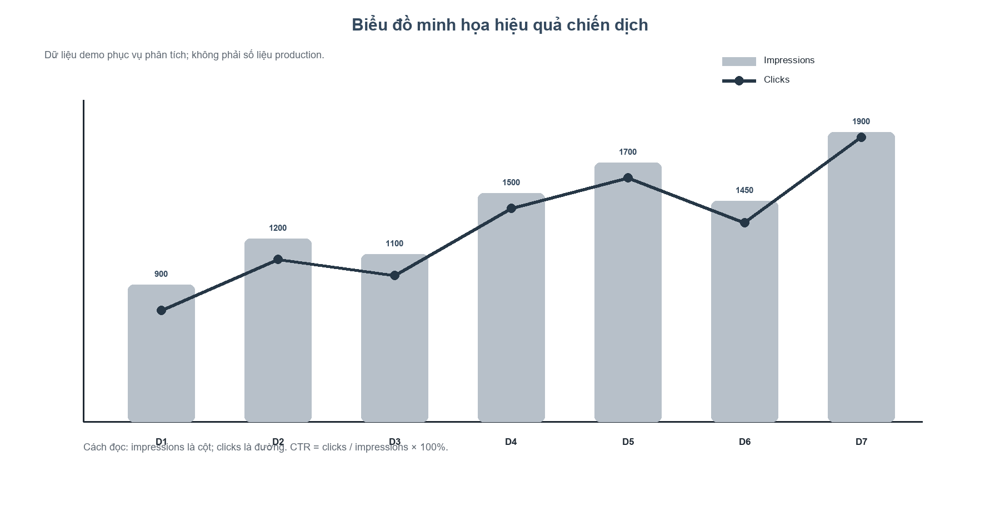

# BÁO CÁO DỰ ÁN

## HỆ THỐNG QUẢN LÝ CHIẾN DỊCH MARKETING CÓ TÍCH HỢP AI

**Học phần:** Ứng dụng trí tuệ nhân tạo - AIA331
**Mã số:** 80300
**Hình thức:** Dự án
**Nhóm:** 25
**Lớp:** CNTTK23C
**Khoa:** Công nghệ thông tin
**Trường:** Trường Đại học Công nghệ Thông tin và Truyền thông Thái Nguyên
**Thành viên:** Nguyễn Hải Đăng (`dtc2451200051`); Vũ Hiếu Kiên (`dtc245200244`)
**Cấp ưu tiên hồ sơ:** P1 / HIGH — hồ sơ phải bám hai nguồn P0 / CRITICAL

> Tài liệu này đối chiếu hai nguồn P0 / CRITICAL: `source-materials/BÀI KIỂM TRA.png`
> (10 tiêu chí đánh giá) và `source-materials/DỰ ÁN.png` (đề tài chính thức).
> Nội dung chưa có code/test được đánh dấu `PROPOSED` hoặc `OPEN`, không trình bày
> như kết quả đã nghiệm thu.

## Tóm tắt

Doanh nghiệp cần quản lý tập trung chiến dịch marketing, kênh truyền thông, nội
dung, ngân sách, lịch đăng và các chỉ số lượt xem, click, chuyển đổi, chi phí.
Báo cáo đề xuất hệ thống Django + SQLite có phân quyền, CRUD chiến dịch, luồng
duyệt nội dung và lớp AI sinh bản nháp. AI được đặt sau adapter có prompt version,
fallback offline và cảnh báo; người phụ trách phải duyệt trước khi sử dụng.

Baseline trong repo đã kiểm chứng model `Campaign`, `Channel`, `Content`, `Metric`,
CRUD đầy đủ cho bốn nhóm dữ liệu, tìm kiếm/lọc/sắp xếp/phân trang campaign,
dashboard KPI có lọc theo ngày và báo cáo hiệu quả theo kênh, approval gate, permission guard, fallback AI và kiểm tra output contract. Provider
thật cần API key; AI performance summary vẫn là `PROPOSED`, còn RAG tài liệu là
công cụ truy hồi phục vụ kiểm chứng hồ sơ, không thay thế metric nghiệp vụ.

---

## 1. Nguồn và phạm vi

### 1.1. Nguồn chính

| ID | Nguồn | Trạng thái | Vai trò |
|---|---|---|---|
| SRC-000 | `source-materials/BÀI KIỂM TRA.png` | CANONICAL | P0 / CRITICAL — 10 tiêu chí đánh giá |
| SRC-001 | `source-materials/DỰ ÁN.png` | CANONICAL | P0 / CRITICAL — đề tài, học phần, mã và yêu cầu |
| SRC-002 | `project.md` | CANONICAL | Bản yêu cầu có ID truy vết |
| SRC-003 | `informember.md` | CANONICAL | Thành viên, lớp, khoa, trường |
| SRC-004 | `marketing_management/` | IMPLEMENTED_BASELINE | Mã nguồn baseline |
| SRC-005 | `marketing_management/campaigns/tests.py` | IMPLEMENTED_BASELINE | Test hành vi |
| SRC-011 | Template format ICTU công khai | REFERENCE | Tham chiếu logo và bố cục bìa; không thay thế mẫu GV cung cấp |

### 1.2. Ranh giới

Phạm vi chính là quản lý chiến dịch marketing và AI hỗ trợ nội dung/phân tích.
Các module sản phẩm, hóa đơn, tồn kho, nhập hàng trong thư mục lịch sử thuộc một
đề tài khác và không được dùng để kết luận về dự án này.

---

## 2. Phân tích bài toán quản lý

### 2.1. Bối cảnh và vấn đề

Thông tin marketing thường bị phân tán ở bảng tính, mạng xã hội, email và các
file báo cáo. Hệ quả là:

- khó biết chiến dịch nào đang chạy, mục tiêu và ngân sách bao nhiêu;
- nội dung không gắn chặt với kênh và lịch đăng;
- số liệu lượt xem, click, chuyển đổi, chi phí khó tổng hợp;
- việc lên ý tưởng và viết caption/email lặp lại;
- nội dung AI có thể chứa claim chưa kiểm chứng nếu không có quy trình duyệt.

### 2.2. Mục tiêu

1. Tập trung hóa campaign, channel, content, schedule, budget và metric.
2. Cho phép tìm kiếm, lọc và thống kê hiệu quả chiến dịch.
3. Dùng AI để sinh ý tưởng/caption/email nháp, tóm tắt metric và gợi ý cải thiện.
4. Bảo đảm người dùng kiểm duyệt nội dung AI trước khi dùng.
5. Lưu được prompt version, trạng thái và bằng chứng kiểm thử.

### 2.3. Actor

| Actor | Use case chính | Quyền dự kiến |
|---|---|---|
| Marketing Manager | Quản lý campaign, xem metric, duyệt content, xem AI summary | Đọc/ghi theo phạm vi quản lý |
| Marketing Staff | Nhập content, lịch đăng, metric, gọi AI sinh nháp | Đọc/ghi nghiệp vụ được giao |
| AI Service | Sinh ý tưởng, draft, summary | Không tự ghi/publish; chỉ nhận context đã lọc |

---

## 3. Yêu cầu chức năng

| ID | Mô tả | Input | Output | Trạng thái |
|---|---|---|---|---|
| FR-001 | Đăng nhập/phân quyền | username/password/role | phiên đăng nhập, quyền | IMPLEMENTED_BASELINE một phần |
| FR-002 | Quản lý campaign | tên, objective, audience, product, dates, budget, status | bản ghi campaign | IMPLEMENTED_BASELINE |
| FR-003 | Quản lý channel | tên, loại, active | bản ghi channel | IMPLEMENTED_BASELINE CRUD |
| FR-004 | Quản lý content/schedule | channel, title/body/type/scheduled_at | content gắn campaign | IMPLEMENTED_BASELINE CRUD |
| FR-005 | Ghi metric | ngày, views, clicks, conversions, cost | metric theo campaign/channel | IMPLEMENTED_BASELINE CRUD + validation |
| FR-006 | Duyệt content | content, approver, action | approved/rejected/published | IMPLEMENTED_BASELINE manager-only routes |
| FR-007 | Tìm kiếm/lọc | tên/status/kênh/khoảng ngày/sort | danh sách campaign | IMPLEMENTED_BASELINE |
| FR-008 | Thống kê | metric | totals, CTR, conversion rate, CPA | IMPLEMENTED_BASELINE dashboard KPI |
| AI-001 | Sinh ý tưởng | brief/objective/audience/product/channel/tone | 5 ideas | IMPLEMENTED_BASELINE fallback |
| AI-002 | Sinh caption/email | brief/channel/tone | draft theo kênh | PROPOSED mở rộng UI |
| AI-003 | Tóm tắt/gợi ý | metrics/budget/period | summary/recommendations | PROPOSED |

### 3.1. Acceptance criteria cốt lõi

- `start_date` không sau `end_date`.
- `clicks <= impressions`, `conversions <= clicks`.
- Không trùng metric cùng campaign/channel/ngày.
- Nội dung AI ở trạng thái draft/pending không được publish.
- Không có API key trong repository.
- Khi không có provider, fallback trả đúng 5 ý tưởng và luôn có warning human review.



---

## 4. Yêu cầu phi chức năng

| ID | Nhóm | Yêu cầu | Cách xác minh |
|---|---|---|---|
| NFR-001 | Security | authentication, authorization, CSRF, env secret, không commit API key | code review + test quyền |
| NFR-002 | AI safety | không bịa claim, không tự đăng, có warning | unit/integration test + review |
| NFR-003 | Data integrity | validation và unique constraint | model test/migration |
| NFR-004 | Availability | migrate/seed/run sạch; backup/restore có hướng dẫn | runbook + restore check |
| NFR-005 | Performance | CRUD p95 mục tiêu <2 giây/50 user; AI timeout 20 giây | target + timeout/fallback |
| NFR-006 | Authorization | Staff nhập; Manager duyệt/từ chối/đăng; route đều kiểm tra role | permission tests |
| NFR-007 | UX | status/filter/error/empty state rõ | manual/browser check |
| NFR-008 | Maintainability | module hóa app, prompt tách khỏi view | structure review |
| NFR-009 | Printability | A4; in đen trắng vẫn đọc được; màu không phải tín hiệu duy nhất; sơ đồ/biểu đồ có nhãn và nét phân biệt | grayscale render check |

### 4.1. Ma trận phân quyền

| Chức năng | Marketing Staff | Marketing Manager |
|---|---:|---:|
| Xem/tạo/sửa campaign | Có | Có |
| Quản lý channel | Có | Có |
| Tạo content và ghi metric | Có | Có |
| Duyệt/từ chối/đăng content | Không | Có |
| Xem thống kê và gọi AI | Có | Có |

Backup SQLite, RPO/RTO và cách restore được ghi tại
`docs/12-operations-and-backup.md`.

---

## 5. Use case

### UC-01 — Tạo chiến dịch

- **Actor:** Marketing Manager/Staff.
- **Tiền điều kiện:** đã đăng nhập và có quyền.
- **Luồng chính:** mở form → nhập objective/audience/product/dates/budget → hệ
  thống validate → lưu campaign → hiển thị chi tiết.
- **Ngoại lệ:** ngày sai hoặc ngân sách âm → báo lỗi, không lưu.
- **Hậu điều kiện:** campaign có status và người tạo.

### UC-02 — Sinh nội dung AI và duyệt

- **Actor:** Staff yêu cầu; Manager duyệt.
- **Luồng chính:** chọn brief/kênh/giọng → AI adapter tạo draft → lưu/hiển thị
  warning → Manager kiểm tra → approve hoặc reject → chỉ approved mới publish.
- **Ngoại lệ:** provider lỗi/thiếu key → fallback; thiếu dữ liệu → warning.
- **Hậu điều kiện:** content có source AI, prompt version và trạng thái duyệt.

### UC-03 — Theo dõi hiệu quả

- **Actor:** Manager/Staff được cấp quyền.
- **Luồng chính:** nhập metric theo ngày/kênh → hệ thống validate → aggregate →
  hiển thị views/clicks/conversions/cost/CTR/CPA.
- **Ngoại lệ:** click vượt view hoặc conversion vượt click → từ chối.


---

## 6. Thiết kế dữ liệu

### 6.1. Bảng chính

| Bảng | Khóa chính | Khóa ngoại | Ràng buộc |
|---|---|---|---|
| `campaigns_channel` | id | — | name unique |
| `campaigns_campaign` | id | created_by → User | budget >= 0, date range |
| `campaigns_content` | id | campaign, channel, approved_by → User | status workflow |
| `campaigns_metric` | id | campaign, channel | unique campaign/channel/date; nonnegative |

### 6.2. Quan hệ

- Campaign 1–N Content.
- Campaign 1–N Metric.
- Channel 1–N Content.
- Channel 1–N Metric.
- User 1–N Campaign qua `created_by` và 1–N Content qua `approved_by`.


---

## 7. Kiến trúc hệ thống

```text
Browser
  -> Django URLs/Views + auth/RBAC
  -> Forms/Services/validation
  -> Django ORM + SQLite
  -> Campaign/Channel/Content/Metric/User
  -> AI adapter (prompt version + provider/fallback + JSON validation)
  -> human approval gate
```


### 7.1. Mapping code

| Layer | File | Trách nhiệm | Trạng thái |
|---|---|---|---|
| Config | `marketing_management/config/settings.py` | Django/SQLite/env | IMPLEMENTED_BASELINE |
| Model | `campaigns/models.py` | entity, validation, aggregate, approval | IMPLEMENTED_BASELINE |
| Form | `campaigns/forms.py` | input form | IMPLEMENTED_BASELINE |
| Service | `campaigns/services.py` | create campaign transaction | IMPLEMENTED_BASELINE |
| View | `campaigns/views.py` | auth/list/create/detail/channel/metric/approval/AI | IMPLEMENTED_BASELINE |
| AI | `campaigns/ai_service.py` | prompt/provider/fallback/schema validation | IMPLEMENTED_BASELINE |
| Test | `campaigns/tests.py` | 25 test model/permission/view/AI/CRUD/filter/dashboard/report/pagination/seed | IMPLEMENTED_BASELINE |

---

## 8. Định vị AI

### 8.1. AI trong sản phẩm

AI-001/002 hỗ trợ tạo draft; AI-003 có thể tóm tắt metric. AI không phải nguồn
sự thật của ngân sách/metric và không tự thay đổi dữ liệu.

### 8.2. AI trong SDLC

| Giai đoạn | Cách sử dụng | Minh chứng |
|---|---|---|
| KT1 | phân tích actor, FR/NFR, ERD, vị trí AI | `docs/` + prompt review |
| KT2 | sinh model/CRUD/test/debug | 25 test + `manage.py check` |
| KT3 | thử prompt, kiểm tra schema/overclaim | `evidence/ai/AI-CAM-001-v1-review.md` |
| Cuối kỳ | tạo README/report/asset và review | LaTeX/PDF + checklist |

---

## 9. Prompt và AI contract

### 9.1. Prompt system

```text
Bạn là trợ lý marketing. Tạo nội dung nháp để con người duyệt; chỉ dùng thông
tin được cung cấp; không bịa cam kết, số liệu, giải thưởng hoặc chứng nhận; không
tự đăng. Nếu thiếu dữ liệu, nêu warning.
```

### 9.2. Prompt user

```text
Campaign brief: {{campaign_brief}}
Objective: {{objective}}
Audience: {{audience}}
Product: {{product}}
Channel: {{channel}}
Tone: {{tone}}
Hãy đề xuất đúng 5 ý tưởng, mỗi ý tưởng gồm title, hook, draft và CTA.
```

### 9.3. Output contract

```json
{
  "provider": "fallback|provider-name",
  "prompt_version": "AI-CAM-001-v1",
  "ideas": [{"title": "...", "channel": "...", "hook": "...", "draft": "...", "cta": "..."}],
  "requested_count": 5,
  "needs_human_approval": true,
  "warning": "..."
}
```

Backend chỉ nhận provider output khi có đúng 5 object đủ `title`, `channel`,
`hook`, `draft`, `cta`, đúng prompt version và approval flag; nếu sai schema,
timeout hoặc lỗi mạng thì dùng fallback.

---

## 10. Kiểm thử và minh chứng

Lệnh đã dùng:

```powershell
cd marketing_management
.venv\Scripts\python.exe manage.py migrate --noinput
.venv\Scripts\python.exe manage.py test campaigns -v 1
.venv\Scripts\python.exe manage.py check
.venv\Scripts\python.exe manage.py migrate --check
```

Các test hiện có (**25 test**):

1. Aggregate metric và tính CTR/conversion rate/cost per conversion.
2. Chặn publish khi content AI chưa được duyệt; cho publish sau approve.
3. Fallback AI trả 5 ý tưởng, provider/fallback và warning/approval flag.
4. User staff xem được danh sách chiến dịch; user không có role bị chặn dashboard.
5. Metric sai funnel bị từ chối; staff ghi metric được qua form.
6. Manager duyệt content qua route; AI endpoint từ chối brief rỗng.
7. Provider output sai contract chuyển fallback an toàn.
8. Campaign/Channel/Content/Metric đều hỗ trợ update và POST delete.
9. Campaign list lọc theo từ khóa, channel, khoảng ngày và sắp xếp.
10. Bộ lọc ngày/sắp xếp sai trả thông báo, không làm ứng dụng crash.
11. Dashboard aggregate KPI từ metric và số nội dung chờ duyệt.
12. Xóa channel đang được tham chiếu xử lý `ProtectedError` an toàn.
13. Staff bị chặn các route delete chỉ dành cho manager.
14. `seed_demo` idempotent và không lỗi mã hóa console Windows.
15. Dashboard lọc metric theo khoảng ngày và nhóm KPI theo kênh.
16. Biểu đồ thanh dashboard có nhãn mô tả và hoạt động cùng bảng số liệu.
17. Campaign list phân trang 8 dòng/trang và giữ nguyên bộ lọc khi chuyển trang.
18. Provider contract hợp lệ được chấp nhận; contract sai chuyển fallback an toàn.

Kết quả gần nhất: 25 tests, OK; Django system check không có lỗi; migration
check đạt. PDF A4 đã được render kiểm tra ở cả màu và grayscale; biểu đồ/sơ đồ
không dùng màu làm tín hiệu duy nhất. Phản hồi AI fallback đã lưu và kiểm chứng tại
`evidence/ai/AI-CAM-001-v1-review.md` cùng JSON redacted.

### 10.1. Đối chiếu Bài kiểm tra thường xuyên 2

Ma trận đầy đủ 10 tiêu chí, lệnh chạy và giới hạn bằng chứng nằm tại
`docs/13-bai-2-implementation.md`. Baseline hiện có cấu trúc dự án, đăng nhập và
RBAC, CRUD bốn nhóm dữ liệu, tìm kiếm/lọc/sắp xếp, dashboard KPI, validation và
README/`.env.example`. Minh chứng AI hỗ trợ lập trình được lưu tại
`evidence/ai/B2-CODE-001-v1-review.md`. Minh chứng template/test client cho
dashboard, biểu đồ ARIA và phân trang nằm tại
`evidence/runtime/B2-UI-001-v1-review.md`; chưa tuyên bố kiểm thử mọi trình duyệt
khi môi trường DevTools chưa được cấu hình.

---

## 11. Rủi ro và điểm mở

| ID | Rủi ro/điểm mở | Mức | Cách xử lý |
|---|---|---|---|
| RISK-001 | Provider ngoài chưa gọi thật | Cao | fallback + mock/contract; cần API key/endpoint |
| RISK-002 | Overclaim/prompt injection | Cao | grounding + approval + redaction |
| RISK-003 | Ma trận quyền cần xác nhận | Trung bình | test quyền; chốt khi demo |
| RISK-004 | AI UI summary chưa có | Trung bình | giữ PROPOSED |
| RISK-005 | Tài liệu legacy | Cao | loại khỏi manifest |

---

## 12. Kế hoạch triển khai tiếp

1. Bổ sung audit log đầy đủ cho các thao tác duyệt/xóa.
2. Thêm màn hình AI ideas và tạo Content từ draft với audit record.
3. Thêm AI performance summary từ metric đã kiểm quyền.
4. Nếu được cấp endpoint, bổ sung integration test provider thật, timeout và
   schema lỗi.
5. Tiếp tục kiểm thử browser/hiệu năng production nếu triển khai ngoài demo local.

## Kết luận

Đề tài đúng của nhóm là **Hệ thống quản lý chiến dịch marketing có tích hợp AI**,
không phải hệ thống quản lý bán hàng. Hồ sơ đã xác định bối cảnh, actor, FR/NFR,
dữ liệu, kiến trúc, vị trí AI, prompt, approval gate, backup và minh chứng phản
hồi. Baseline code/test khớp với các trạng thái trong báo cáo; provider thật và
AI summary vẫn giữ nhãn `PROPOSED/OPEN` để bảo đảm trung thực học thuật.
